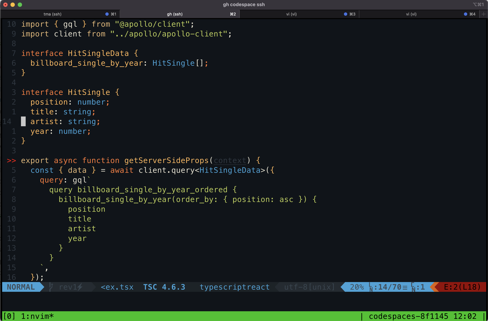
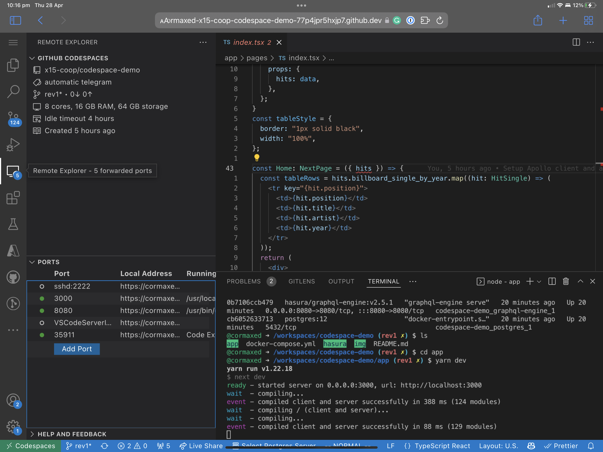

# Codespace Demo Project

The demo project is a non-trivial Codespace development environment representing a full-stack project using React, Next.js, Hasura and Postgres.

The development environment demonstrates the following:

- Creating a Devcontainer with Docker-In-Docker support
- Running Hasura and Postgres as Docker containers
- Initialising Hasura metadata, migrating Postgres tables and loading seed data when a Codespace is created
- Starting Docker containers automatically when a Codespace is resumed
- Running and debugging a Next.js project in VSCode
- Using ssh, tmux and neovim as an alternative to VSCode
- Using VSCode in the browser on an iPad Pro.

## Getting Started

Fork or copy this repository; make sure your Github team can access the repository, so it's also visible to Codespaces. You can find detailed instructions for creating a Codespace [here](https://docs.github.com/en/codespaces/developing-in-codespaces/creating-a-codespace).

After the Codespace has launched, open a terminal and run:

```bash
cd app
yarn install
yarn dev
```

Open [http://localhost:3000](http://localhost:3000) in your browser; you should see a page with the billboard top 10 singles in 1980.


## Want To Learn More?

### Docker

The Docker [container](/.devcontainer/Dockerfile) uses the Microsoft [Node 16](https://github.com/microsoft/vscode-dev-containers/tree/main/containers/javascript-node) base container. The base is extended with the following software:

- Docker Engine
- Docker Compose
- Neovim
- Tmux
- Hasura Cli
- Postgres Client
- Azure Functions Core Tools 4

### Post Create

A [postCreate](.devcontainer/postCreate.sh) script is used to:

- Start the Docker engine; we are running inside a container, so services won't automatically start.
- Bring up a Hasura and Postgres container via [docker-compose](docker-compose.yml)
- Wait for Hasura to start, and then:  
  - Load Hasura metadata
  - Migrate Postgres tables
  - Load seed data, the billboard top 10 songs of 1980.

### Post Start

A [postStart](.devcontainer/postStart.sh) script is used to restart our Docker containers after a Codespace is suspended.

The post-start script:

- Restarts Docker
- Bring up a Hasura and Postgres container via [docker-compose](docker-compose.yml)

### SSH

Codespaces supports SSH access using the Github Cli. SSH access enables development using tmux and neovim if that is your thing.

To connect via SSH.
```bash
#Find your Codespace
gh codespace list

#Connect
gh codespace ssh -c <codespace>
```

You can add your Codespace to your ssh client config by:

```bash
gh codespace ssh --config -c <codespace> >> ~/.ssh/config

```

Add keepalive settings and persistent port forwards to the ssh configuration.

```
Host codespace
    User node
    ProxyCommand /opt/homebrew/bin/gh cs ssh -c <codespace> --stdio
    UserKnownHostsFile=/dev/null
    StrictHostKeyChecking no
    LogLevel quiet
    ControlMaster auto
    ServerAliveCountMax 360
    ServerAliveInterval 10
    Protocol 2
    LocalForward 8080 127.0.0.1:8080
```

Once you are connected, you can start tmux and start editing in neovim.

```bash
tmux

cd /workspaces/codespace-demo
nvim
```



### VSCode in the Browser

To access VSCode on an iPad. Open Safari, log on to Github, select a Codespace and Open in Browser.

The critical difference with browser based access is ports are forwarded using HTTPS URLs. You access forwarded ports by going to Remote Explorer and clicking the local address.



## Work Arounds

### Docker Compose

By default, inter container communication didn't work with platforms brought up with `docker-compose`. My workaround is to enable ICC by creating a default network explicitly.

```
networks:
  default:
    driver: bridge
    driver_opts:
      "com.docker.network.bridge.default_bridge": "true"
      "com.docker.network.bridge.enable_icc": "true"
      "com.docker.network.bridge.enable_ip_masquerade": "true"
      "com.docker.network.bridge.host_binding_ipv4": "0.0.0.0"
      "com.docker.network.bridge.name": "docker0"
      "com.docker.network.driver.mtu": "1500"
    ipam:
      driver: default
      config:
        - subnet: 173.21.0.0/24
          gateway: 173.21.0.1
```

### Docker restart

After a Codespace is suspended Docker is left in a dirty state. The [postStart](.devcontainer/postStart.sh) script cleans things up by:

- Removing old networks
- Deleting the old PID file
- Removing old containers
